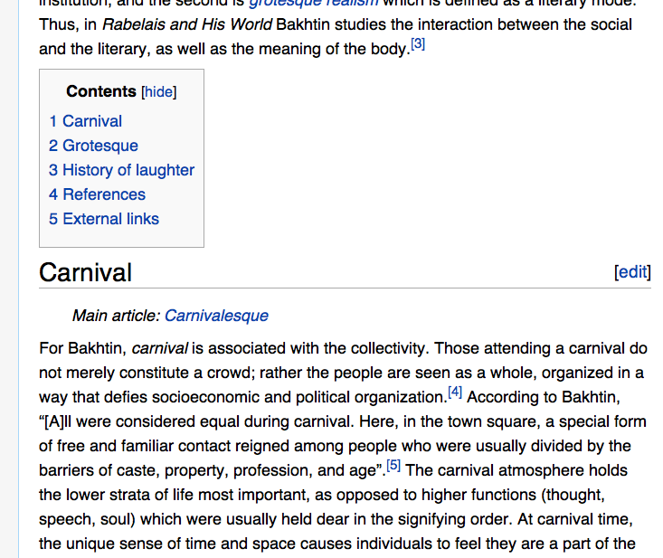
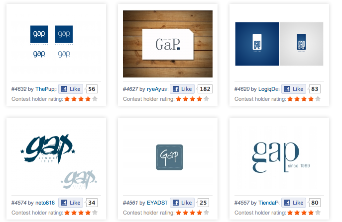
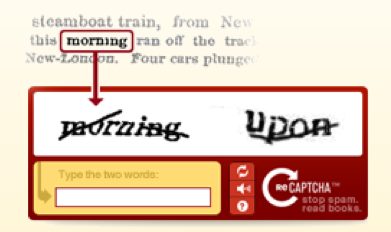
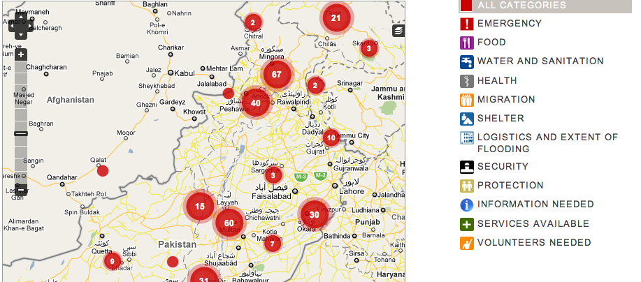

!SLIDE fp incremental center
# Crowdsourcing #
## at  ##

### Brian P O'Rourke, Director of Engineering ###

.notes '

!SLIDE center

## Backstory ##

.notes Founded in 2007, lots of crowdsourcing experiments led to providing crowdsourcing services for clients. Flagship product is a general-purpose crowdsourcing application and API

!SLIDE incremental
# This Talk

### What is Crowdsourcing? ###
### What is Programmatic Crowdsourcing? ###
### What can it be used for? ###
### Demo Time ###
### Wrapup & Questions ###

!SLIDE incremental

# What is Crowdsourcing? #

!SLIDE center transition=toss
# Examples of Crowdsourcing #
## Wikipedia ##

.notes content generation and curation all crowd-driven

!SLIDE center transition=toss
# Examples of Crowdsourcing #
## 99 Designs ##

.notes manual review, major contest-style rewards

!SLIDE center transition=toss
# Examples of Crowdsourcing #
## reCAPTCHA ##

.notes gold standard checks, fully-automated quality control: programmatic crowdsourcing

!SLIDE incremental
# Programmatic Crowdsourcing #

* ## crowdsourcing x human computation ##
* ## small units of work ##
* ## high volume ##
* ## automatically verifiable ##

!SLIDE center
# Who is using it now? #

!SLIDE center transition=toss
# Who is using it now? #
## CrowdFlower Clients ##

.notes talk about one or two enterprisey clients that are doing big volume.

!SLIDE center transition=toss
# Who is using it now? #
## PakReport.org ##

!SLIDE center transition=toss
<iframe src="http://pakreport.crowdflower.com"></iframe>

!SLIDE center transition=toss
# Who is using it now? #
## NowTakeABow.com ##

<object width="640" height="385"><param name="movie" value="http://www.youtube.com/v/X9vStmM9zds?fs=1&amp;hl=en_US"></param><param name="allowFullScreen" value="true"></param><param name="allowscriptaccess" value="always"></param><embed src="http://www.youtube.com/v/X9vStmM9zds?fs=1&amp;hl=en_US" type="application/x-shockwave-flash" allowscriptaccess="always" allowfullscreen="true" width="640" height="385"></embed></object>

!SLIDE center transition=toss
<iframe src="http://crowdflower.com/jobs/21166/preview"></iframe>

!SLIDE center transition=toss
# Who is using it now? #
## The Wilderness Downtown ##

!SLIDE center transition=toss
<iframe src="http://crowdflower.com/jobs/21140/preview"></iframe>

!SLIDE
# Demo time #

!SLIDE

<iframe src="http://faces.heroku.com"></iframe>

!SLIDE incremental
# CrowdFlower Platform #

* ## Design ##
* ## Quality ##
* ## Channels ##

!SLIDE incremental
# Terms #

* ## Job ##
* ## Unit ##
* ## Judgment ##

!SLIDE
# Ruby API Code #
    @@@ ruby
    CrowdFlower.connect!(KEYS["crowdflower_key"])

    post "/faceit" do
      @job = CrowdFlower::Job.new(KEYS["job_id"])
      @unit = CrowdFlower::Unit.new(@job)
      @unit.create(JSON.parse(params[:data])).to_json
    end

!SLIDE
# Unit Data #
    @@@ javascript
    {
      "images": ["http://images.google.com/images?q=tbn:dPRB21Eho0DGTM", ...],
      "source": "http://images.google.com/images?q=tbn:cs3VGWQHQBuCyM",
      "query": "Chris Van Pelt"
    }
    
!SLIDE
# CML #
    @@@ html
    <h2>Source Image:</h2>
    <image src="{{source}}" />
    

    <cml:iterate on="images">
      <image src="{{images}}" />
      <cml:radios label="Same as source?" gold="true" validates="required">
        <cml:radio label="Yes"></cml:radio>
        <cml:radio label="No" checked="true"></cml:radio>
      </cml:radios>
    </cml:iterate>
    
!SLIDE

<iframe src="http://crowdflower.com/jobs/24647/preview?raw=true"></iframe>
    
!SLIDE

<iframe src="http://crowdflower.com/jobs/24647/preview"></iframe>

!SLIDE

<iframe src="https://crowdflower.com/jobs/24647/golds/41957821/edit"></iframe>

!SLIDE

<iframe src="https://crowdflower.com/judgments/amt/24647?override=true&amp;workerId=cvp"></iframe>

!SLIDE
# Unit Response #
    @@@ javascript
    {
      "results": {
        "judgments": [{
          "worker_trust": 0.9,
          "city": "San Francisco",
          "external_type": "amt",
          "data": { ... },
          ...
        }, ... ],
        "same_as_source": {
          "agg": ["No", "Yes", "No", "Yes", "No", "No", "No", "No", "Yes", "No", "No", "No", "No", "Yes", "No", "No", "No", "No", "No", "Yes", "Yes", "No", "No", "No", "No", "No", "No", "No", "No", "No", "No"],
          "confidence": 0.734
        }
      },
      "data": { ... },
      "judgments_count": 3,
      ...
    }

!SLIDE incremental
# Programmatic Crowdsourcing #

* * ## break your data up into small pieces ##
  * ## send it to the crowd for evaluation ##
  * ## receive results via callbacks ##

!SLIDE incremental
# What else can you use it for? #

* ## small units of work ##
* ## high volume ##
* ## automatically verifiable ##

!SLIDE thanks
# Thanks. Questions? #

## brian@crowdflower.com ##

### crowdflower.com/docs/api ###
### @crowdflower : github.com/dolores ###
